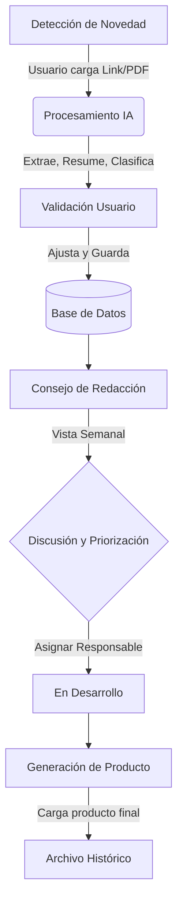
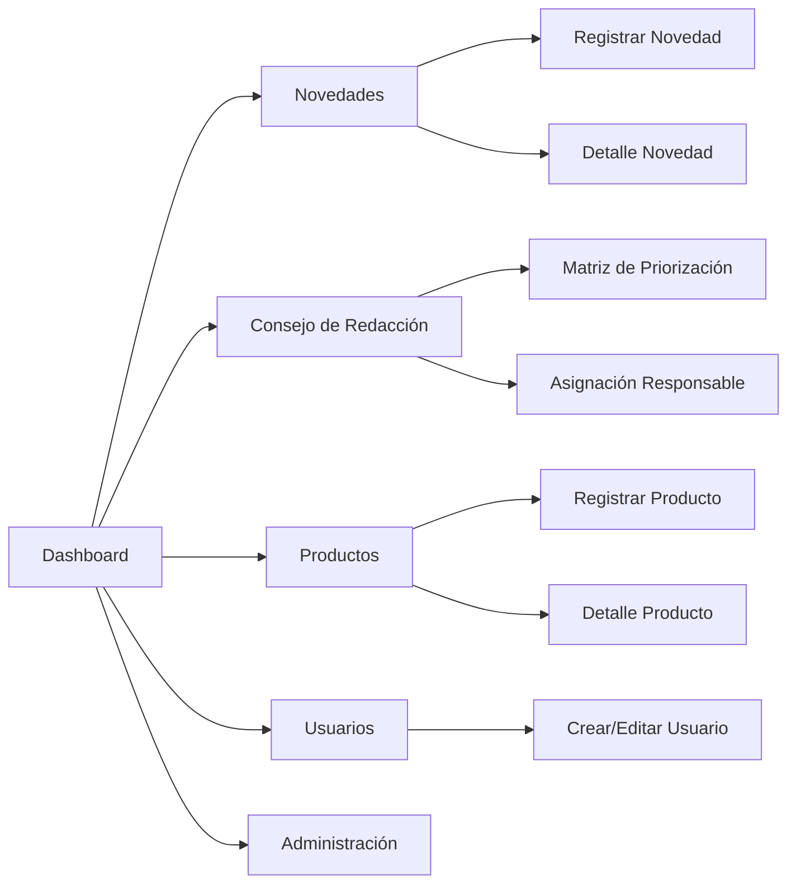
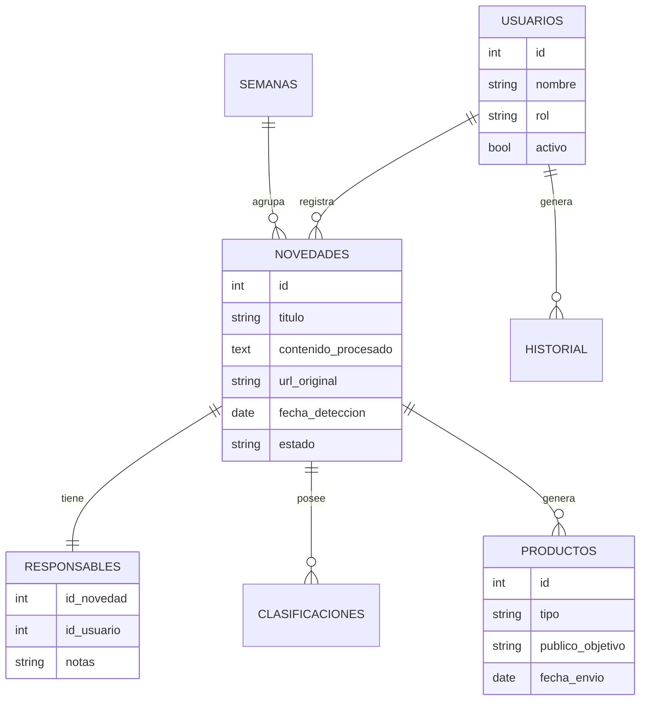

# Documento Base del Proyecto

## Plataforma de Apoyo al Consejo de Redacción CTi – Ruta N

## 1. Descripción General del Proyecto

El **Centro de Pensamiento CTi de Ruta N Medellín** requiere una plataforma web que permita identificar, procesar, priorizar, analizar y gestionar información coyuntural relevante para la Ciencia, la Tecnología y la Innovación (CTI). Esta herramienta servirá como insumo estratégico para el **Consejo de Redacción semanal** y la elaboración de productos como boletines, cápsulas y análisis temáticos.

El sistema debe integrar **IA (modelos de lenguaje gratuitos o open-source)** para automatizar la extracción, clasificación y resumen preliminar de noticias o documentos, permitiendo que el usuario se enfoque en enriquecer el análisis desde su experticia.

---

## 2. Objetivos del Proyecto

### 2.1 Objetivo General

Desarrollar un sitio web (o aplicación web) que permita gestionar, analizar y priorizar contenido informativo relevante para la CTI de Medellín y para la Corporación Ruta N Medellín.

### 2.2 Objetivos Específicos

- **Automatizar** la identificación y captura de información relevante.
- Permitir que un usuario **cargue una noticia, enlace o documento PDF** para análisis.
- Utilizar **IA** para generar resúmenes y clasificaciones preliminares.
- **Estandarizar** los registros de novedades según los criterios actuales del Centro de Pensamiento.
- Dar soporte al **flujo operativo del Consejo de Redacción**.
- Gestionar **responsables, estados, productos generados e historial**.
- **Centralizar** toda la información en una base de datos PostgreSQL para futuras analíticas.

---

## 3. Alcance Inicial (MVP)

El MVP se enfocará en cubrir las funcionalidades mínimas necesarias para habilitar el ciclo completo:

### 3.1 Registro de novedades (input de fuentes)

- Carga manual de enlaces o texto.
- Carga de documentos PDF relevantes.
- Captura automática de metadatos (título, fuente, fecha…).
- **Clasificación automática por IA**:
  - Temática principal.
  - Ámbito geográfico.
  - Áreas internas afectadas.
  - Riesgos y oportunidades.
- Generación de resumen preliminar basado en CTI.

### 3.2 Validación del usuario

- El usuario amplía o ajusta las interpretaciones sugeridas por la IA.
- Se registra la versión final del análisis.

### 3.3 Almacenamiento

- Almacenar en base de datos **PostgreSQL** toda la metadata, archivos y comentarios.
- Control del ciclo de vida de cada novedad.

### 3.4 Prioridad y flujo semanal

- Panel del Consejo de Redacción.
- Matriz de priorización.
- Asignación de responsable para cada tema.
- **Estado del tema**: `Identificado` → `En análisis` → `Priorizado` → `En desarrollo` → `Producto generado` → `Archivado`.

### 3.5 Gestión de productos

- Registro del producto generado por semana (boletín, cápsula, análisis).
- Gestión del envío a dirección.

---

## 4. Funcionalidades Futuras (Roadmap)

- [ ] Integración con extensiones de navegador.
- [ ] Motor de búsqueda avanzado.
- [ ] Dashboard con analítica de tendencias.
- [ ] Exportación automática con plantillas del manual de marca.
- [ ] Sistema de permisos y roles avanzados.
- [ ] Módulo colaborativo con comentarios por registro.
- [ ] API para integrar datos con otros sistemas de Ruta N.
- [ ] Análisis de riesgos y oportunidades con modelos predictivos.

---

## 5. Arquitectura Técnica Propuesta

### 5.1 Frontend

- **Framework**: React + Next.js
- **Autenticación**: Selección simple de usuario (MVP). A futuro: Azure AD, Keycloak o LDAP.
- **Estilos**: Componentes reutilizables basados en el **Manual de Marca Ruta N**.

### 5.2 Backend

- **Lenguaje**: Python (FastAPI).
- **Microservicios**:
  - Procesamiento de texto.
  - Extracción de contenido de PDFs.
  - Integración con cliente de IA (Gemini).
  - Endpoints para manejo de usuarios, registros y documentos.

### 5.3 Inteligencia Artificial

- **Proveedor**: Google Gemini API (Free Tier).
- **Alternativa**: Otros LLM vía API si se requiere.
- **Ejecución**: Nube (Google Cloud). No se requiere despliegue local de modelos pesados.
- **Funciones**:
  - Extracción de temas clave.
  - Resumen preliminar desde enfoque CTI.
  - Identificación de impactos y riesgos.
  - Clasificación.

### 5.4 Base de Datos

- **Tecnología**: PostgreSQL local.
- **Entidades principales**: `novedades`, `archivos`, `clasificaciones`, `usuarios`, `productos_generados`, `semanas`, `priorizaciones`, `responsables`.

### 5.5 Infraestructura

- **Despliegue**: Local en servidor Ruta N (Linux).
- **Contenedorización**: Docker (Backend, Frontend, PostgreSQL).
- **Recursos**: 8 GB RAM, Sin GPU, +40 GB almacenamiento.

---

## 6. Flujo Operativo del Sistema



---

## 7. Requerimientos

### 7.1 Funcionales (RF)

| ID | Descripción |
| :--- | :--- |
| **RF01** | Sistema debe permitir registro de novedades. |
| **RF02** | Sistema debe analizar y resumir noticias con IA. |
| **RF03** | Usuario valida y complementa la información. |
| **RF04** | Registrar todos los datos en PostgreSQL. |
| **RF05** | Panel para Consejo de Redacción. |
| **RF06** | Matriz de priorización. |
| **RF07** | Asignación de responsables. |
| **RF08** | Registro de productos generados. |
| **RF09** | Gestión de estados. |
| **RF10** | Buscador por filtros múltiples. |

### 7.2 No Funcionales (RNF)

| ID | Descripción |
| :--- | :--- |
| **RNF01** | Disponibilidad mínima 95%. |
| **RNF02** | Procesamiento de IA local sin depender de servicios externos. |
| **RNF03** | Diseño acorde al manual de marca Ruta N. |
| **RNF04** | Responsive para tablets. |
| **RNF05** | Seguridad y autenticación (básica/trazabilidad). |
| **RNF06** | Tiempos de respuesta aceptables (<3 s para búsquedas). |

---

## 9. Definiciones Finales del Proyecto (Resueltas)

### 9.1 Autenticación y usuarios

- **Sin login corporativo** inicial.
- **Selección de usuario** vía menú desplegable (lista de usuarios activos).
- **Administrador**: Único con acceso a módulo de gestión de usuarios (Añadir, Activar/Desactivar, Roles).
- **Roles**:
  - Administrador
  - Editor / Analista CTI
  - Líder CP
  - Lector

### 9.2 Manual de marca

- **Fuente**: *Manual de Marca Ruta N V2.pdf*.
- **Tipografías**: Neue Haas Grotesk (títulos), Source Sans Pro (textos).
- **Estilo**: Iconografía outline minimalista, uso de la "n" como recurso gráfico.

### 9.3 Infraestructura y Hardware

- **SO**: Linux.
- **Hardware**: 8 GB RAM, Sin GPU.
- **Consecuencia**: Uso obligatorio de APIs externas para IA (Gemini) para evitar sobrecarga del servidor.

### 9.4 Almacenamiento de documentos

- **Política**: Procesamiento efímero.
- **Flujo**: Carga -> Descarga Temporal -> IA Procesa -> Archivo Eliminado.
- **Persistencia**: Solo se guarda URL original, Texto procesado y Metadatos.

### 9.5 IA

- **Modelo**: Gemini API (Free Tier).
- **OCR**: No incluido en MVP. Si es imagen escaneada: "PDF no procesable".

---

## 10. Mapa de Navegación del Sitio



---

## 11. Modelo Entidad–Relación (Propuesto)



---

## 13. Mockups Iniciales (Baja Fidelidad)

### 13.1 Mockup 1 — Dashboard

```text
|                      RUTA N — CTI App                   |
|---------------------------------------------------------|
|  Menu lateral:        |  Dashboard                      |
|  - Dashboard          |---------------------------------|
|  - Novedades          |  [Resumen Semanal]              |
|  - Consejo Redacción  |   - Novedades detectadas: 12    |
|  - Productos          |   - Pendientes priorizar: 4     |
|  - Usuarios           |   - En desarrollo: 2            |
|  - Administración     |---------------------------------|
|                       |  [Acciones Rápidas]             |
|                       |   (1) Registrar novedad [+]     |
|                       |   (2) Ir al consejo →           |
|---------------------------------------------------------|
|                       |  [Novedades Recientes]          |
|                       |  - Título 1 (estado)            |
|                       |  - Título 2 (estado)            |
```

### 13.2 Mockup 2 — Registrar Novedad

```text
|                 Registrar nueva novedad                 |
|---------------------------------------------------------|
| [Campo: URL] ________________________________________   |
| [O subir PDF]  [Seleccionar archivo...]                 |
| [Usuario postulador: ▼]                                 |
| [Botón: Procesar con IA]                                |
|==================== RESULTADO DE IA ====================|
|  - Título sugerido: _________________________________   |
|  - Resumen IA: "Esta noticia trata..."                  |
|  - Temática principal (IA): ▼                           |
|  - Ámbito geográfico (IA): ▼                            |
|  - Impactos: □ Ruta N  □ Medellín  □ Ecosistema CTI     |
| [Botón: Guardar novedad]                                |
```

### 13.3 Mockup 3 — Detalle de Novedad

```text
|                 Detalle de novedad (ID: 0231)           |
|----------------------------------------------------------|
| [Título editable]                                        |
| "Impacto de política X en la innovación…"               |
|----------------------------------------------------------|
| [Metadatos]                                              |
|  - Fuente: __________________                             |
|  - Fecha publicación: **/**/____                         |
|  - Fecha detección: **/**/____                           |
|  - Usuario postulador:  Alvaro A.                        |
|  - Estado:  [Identificado ▼]                             |
|                                                          |
|----------------------------------------------------------|
| [Contenido extraído (IA)]                                |
|  (Texto largo procesado)                                 |
|----------------------------------------------------------|
| [Resumen generado por IA]                                |
|   "La noticia indica que..."                             |
|  [Botón: Regenerar IA]                                   |
|----------------------------------------------------------|
| [Ajustes del usuario]                                    |
|   ___________________________________________________    |
|----------------------------------------------------------|
| [Clasificaciones IA]                                     |
|   - Temática: ● Regulación                               |
|   - Geografía: ● Colombia                                |
|   - Impacto:   ● Alto para Ruta N                        |
|----------------------------------------------------------|
| [Acciones]                                               |
|  - Priorizar tema →                                      |
|  - Asignar responsable →                                 |
|  - Enviar a productos →                                  |
```

### 13.4 Mockup 4 — Consejo de Redacción (Vista Semanal)

```text
|               Consejo de Redacción — Semana 05          |
|----------------------------------------------------------|
| [Selector de semana: ▼ 05 / 2026]                       |
|----------------------------------------------------------|
| [Listado de temas de la semana]                         |
|  - Novedad 1 | Estado: Identificado | Prioridad: —       |
|  - Novedad 2 | Estado: Identificado | Prioridad: —       |
|  - Novedad 3 | Estado: En análisis  | Prioridad: —       |
|----------------------------------------------------------|
| [Botón: Abrir matriz de priorización]                   |
|----------------------------------------------------------|
| [Notas del Consejo]                                     |
|  ____________________________________________________    |
|                                                          |
```

### 13.5 Mockup 5 — Matriz de Priorización

```text
|                 Matriz de Priorización                  |
|----------------------------------------------------------|
| Impacto →       |  Bajo       |  Medio      |  Alto      |
|----------------------------------------------------------|
| Urgencia ↓      |                                      |
|   Baja          |  [Tema X]                               |
|----------------------------------------------------------|
|   Media         |  [Tema Y]                               |
|----------------------------------------------------------|
|   Alta          |  [Tema Z]                               |
|----------------------------------------------------------|
| [Guardar priorización]   [Volver]                        |
```

### 13.6 Mockup 6 — Registrar Producto

```text
|                 Registrar producto                       |
|----------------------------------------------------------|
| [Asociar a novedad: ▼]                                   |
| [Tipo de producto: ▼ Boletín / Cápsula / Análisis]       |
| [Campo: Público objetivo] ____________________________   |
|----------------------------------------------------------|
| [Contenido del producto]                                 |
|  _____________________________________________________   |
|  |                                                     | |
|----------------------------------------------------------|
| [O subir archivo]  [Seleccionar archivo...]             |
|----------------------------------------------------------|
| [Fecha de envío: **/**/____]                            |
| [Botón: Guardar producto]                                |
```

### 13.7 Mockup 7 — Gestión de Usuarios

```text
|                    Gestión de Usuarios                  |
|----------------------------------------------------------|
| [Botón: Añadir usuario]                                 |
|----------------------------------------------------------|
|  Lista de usuarios                                      |
|  ------------------------------------------------------ |
|  Nombre          | Rol          | Estado | Acciones     |
| ------------------------------------------------------ |
|  Alvaro A.       | Editor CTI   | Activo | Editar / Off |
|  Yessica G.      | Líder CP     | Activo | Editar / Off |
|  Andrés C.       | Lector       | Inactivo | Editar / On |
|----------------------------------------------------------|
| [Editar usuario seleccionado]                            |
|  - Rol: ▼                                               |
|  - Estado: Activo / Inactivo                            |
|  - Guardar cambios                                      |
```

---

## 14. Paleta de Colores e Indicaciones de Uso

### 14.1 Colores Principales

| Color | Hex | Uso Principal |
| :--- | :--- | :--- |
| **Verde Oscuro** | `#253d36` | Fondo principal, textos sobre claros. |
| **Verde** | `#c0d400` | Destacados clave, datos importantes. |
| **Agua Marina** | `#00b8a3` | Elementos secundarios, gráficos. |
| **Azul** | `#0068ff` | Vínculos, métricas a resaltar. |
| **Amarillo** | `#ffca00` | Llamadas de atención, advertencias. |
| **Rojo-Naranja** | `#ff4c17` | Urgencia, impacto, contrastes fuertes. |
| **Blanco** | `#ffffff` | Texto sobre fondos oscuros. |

### 14.6 Voz y Tono

- **Claridad**: Concisión y profesionalismo.
- **Enfoque**: Acción e impacto.
- **Palabras Clave**: Innovación, colaboración, transformación, ciudad, sostenibilidad, futuro.
