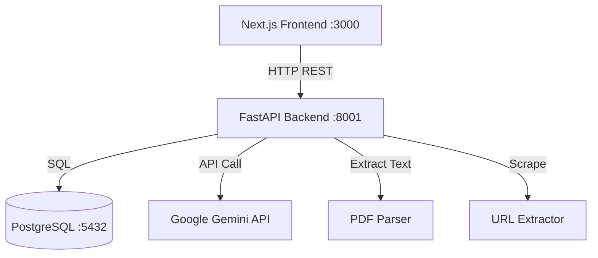
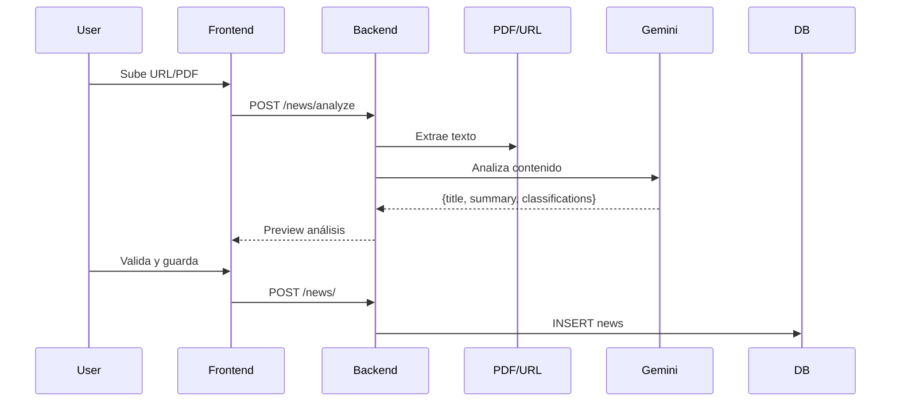
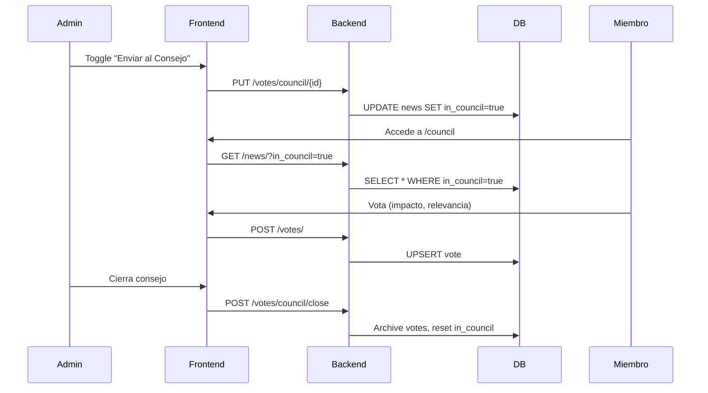
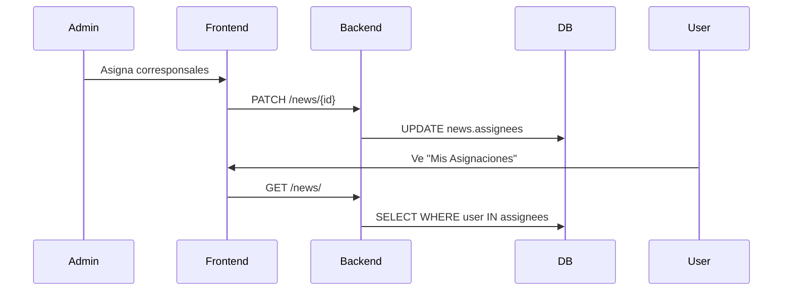

# Arquitectura del Sistema - Consejo de Redacción CTi

## Visión General

El sistema es una aplicación web full-stack para gestionar el flujo de trabajo del Consejo de Redacción del Centro de Pensamiento CTi de Ruta N Medellín.

## Stack Tecnológico

### Frontend

- **Framework**: Next.js 14+ (App Router)
- **Lenguaje**: TypeScript
- **UI**: React 18+ con Tailwind CSS
- **Estado**: Context API (UserContext)
- **Autenticación**: Login con contraseña + selección de usuario

### Backend

- **Framework**: FastAPI (Python 3.10+)
- **ORM**: SQLAlchemy
- **Base de Datos**: PostgreSQL 15
- **IA**: Google Gemini API

### Infraestructura

- **Contenedores**: Docker + Docker Compose
- **Despliegue**: Local en servidor Linux
- **Recursos**: 8GB RAM, sin GPU

## Arquitectura de Componentes



## Estructura del Proyecto

```
ConsejoRedaccion/
├── backend/
│   ├── routers/          # Endpoints REST organizados por dominio
│   │   ├── users.py      # Gestión de usuarios y login
│   │   ├── news.py       # CRUD de noticias y análisis IA
│   │   ├── votes.py      # Votaciones y consejo
│   │   └── analytics.py  # Estadísticas de desempeño
│   ├── services/         # Lógica de negocio
│   │   ├── ai_service.py       # Cliente Gemini
│   │   └── extraction_service.py # Parseo PDF/URL
│   ├── models.py         # Modelos SQLAlchemy
│   ├── schemas.py        # Schemas Pydantic
│   ├── crud.py           # Operaciones de base de datos
│   ├── database.py       # Config DB
│   └── seed.py           # Datos iniciales
│
├── frontend/
│   └── src/
│       ├── app/                    # Rutas Next.js
│       │   ├── login/             # Página de login
│       │   ├── news/              # Gestión de noticias
│       │   ├── council/           # Consejo y matriz
│       │   ├── stats/             # Estadísticas
│       │   └── users/manage/      # Admin usuarios
│       ├── components/            # Componentes React
│       │   ├── ui/                # Primitivos UI
│       │   ├── AuthGuard.tsx      # Protección de rutas
│       │   ├── UserSelector.tsx   # Botón logout
│       │   └── ...
│       ├── context/
│       │   └── UserContext.tsx    # Estado global usuario
│       └── types/
│           └── index.ts           # Tipos TypeScript
│
└── docker-compose.yml
```

## Modelos de Datos

### User

```python
id: int (PK)
name: str
role: str  # "Administrador", "Dirección Ejecutiva", "Postulador", "Lector"
password: str (hashed)
active: bool
```

### News

```python
id: int (PK)
title: str
original_url: str
content_processed: text
summary: text
status: str  # "Identificado", "Priorizado", "En desarrollo", "Archivado"
detection_date: date
postulator_id: int (FK -> users)
category: str  # "Nerd", "Geek", "Trend"
in_council: bool
is_prioritized: bool
editorial_focus: text
classifications: JSON  # {theme, geography, impact, keywords}
assignees: M2M -> users
```

### Vote

```python
id: int (PK)
news_id: int (FK -> news)
user_id: int (FK -> users)
impact_score: int (1-5)
relevance_score: int (1-5)
category_suggestion: str
is_active: bool
session_id: int (FK -> council_sessions, nullable)
```

### CouncilSession

```python
id: int (PK)
summary: text
created_at: datetime
```

## Flujo de Datos

### 1. Registro de Novedad



### 2. Flujo del Consejo



### 3. Asignación y Priorización



## Seguridad

### Autenticación

- Login con contraseña almacenada (hashed con bcrypt)
- Sesión en localStorage (currentUser)
- AuthGuard protege rutas privadas

### Autorización por Rol

| Función | Admin | Dir. Ejecutiva | Postulador | Lector |
|---------|-------|----------------|------------|--------|
| Ver noticias | ✓ | ✓ | ✓ | ✓ |
| Crear noticias | ✓ | ✓ | ✓ | ✗ |
| Votar en consejo | ✓ | ✓ | ✓ | ✗ |
| Enviar al consejo | ✓ | ✗ | ✗ | ✗ |
| Gestionar usuarios | ✓ | ✗ | ✗ | ✗ |
| Editar roles/passwords | ✓ | ✗ | ✗ | ✗ |
| Cerrar consejo | ✓ | ✗ | ✗ | ✗ |
| Limitar a 1 usuario | ✗ | ✓ | ✗ | ✗ |

## Integración con IA

### Gemini API

- **Modelo**: gemini-1.5-flash (rápido y gratuito)
- **Prompt**: Personalizado para análisis CTI
- **Rate Limiting**: Control de concurrencia con asyncio.Semaphore
- **Fallback**: Manejo graceful de errores

### Procesamiento

1. **Extracción de texto**: pypdf para PDFs, requests + BeautifulSoup para URLs
2. **Envío a Gemini**: Prompt estructurado solicitando JSON
3. **Parseo**: Extracción de campos (título, resumen, temática, geografía, impacto, keywords)
4. **Validación**: Usuario puede editar antes de guardar

## Performance y Optimización

### Frontend

- React.memo en componentes puros (`Badge`, `WarningMessage`, `TagInput`)
- useCallback para event handlers estables
- Componentes UI reutilizables (`Button`, `Badge`)
- CSS optimizado con Tailwind (tree-shaking automático)

### Backend

- Queries optimizadas con SQLAlchemy
- Índices en columnas frecuentemente consultadas
- No se almacenan PDFs (solo texto procesado)
- CORS configurado para desarrollo local

## Deployment

### Docker Compose

```yaml
services:
  db: PostgreSQL con volumen persistente
  backend: FastAPI en puerto 8001
  frontend: Next.js en puerto 3000
```

### Variables de Entorno

```
DATABASE_URL=postgresql://...
GEMINI_API_KEY=...
MASTER_PASSWORD=...
```

## Monitoreo y Logs

- FastAPI imprime logs de requests
- Frontend console.error para debugging
- PostgreSQL logs en docker logs

## Roadmap Técnico

### Corto Plazo

- [ ] Implementar productos generados (boletines, cápsulas)
- [ ] Mejorar matriz de priorización con drag & drop
- [ ] Añadir filtros avanzados en dashboard

### Medio Plazo

- [ ] Migrar a autenticación con Azure AD
- [ ] Implementar caché con Redis
- [ ] Añadir tests automatizados (pytest, Jest)

### Largo Plazo

- [ ] API pública con rate limiting
- [ ] Dashboard analítico con gráficas avanzadas
- [ ] Integración con sistemas externos de Ruta N
